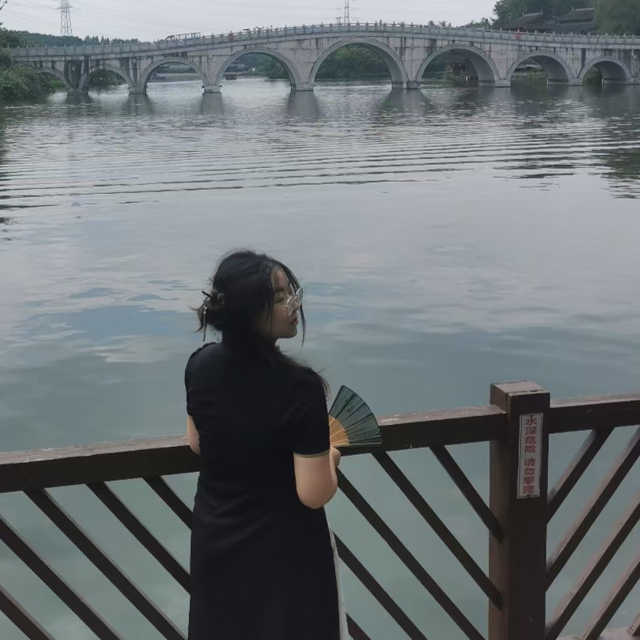

# 🍀 Feilin's Cooperators 🍀
## Feilin is working with several cooperators.

[@Sylvia Wang](https://Sylvia-WangXB.github.io) | [@Ink](https://github.com/Brawrdon) | [@dayhaysoos](https://github.com/dayhaysoos) | [@ifiokjr](https://github.com/ifiokjr)
--- | --- | --- | ---
 |  |  | 

---

# 🌠 Experiment Results 🌠
## Feilin has accomplished several experiments.

**testtesttesttesttest**
*testtesttesttesttest*
- testtesttesttesttest
- 
https://github.com/yflaa/yflaa/assets/138174371/385787922-d3e10ed2-a38e-4538-bfc7-13c906296818
<!-- 
  
 -->
